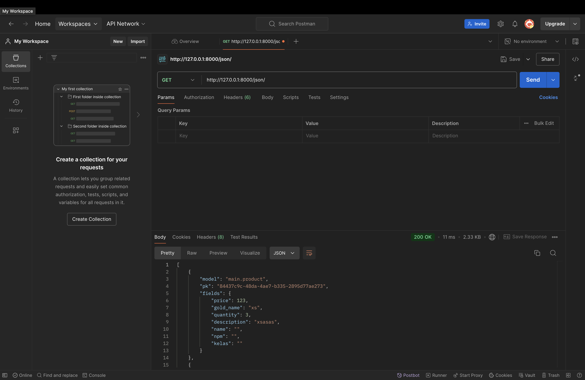
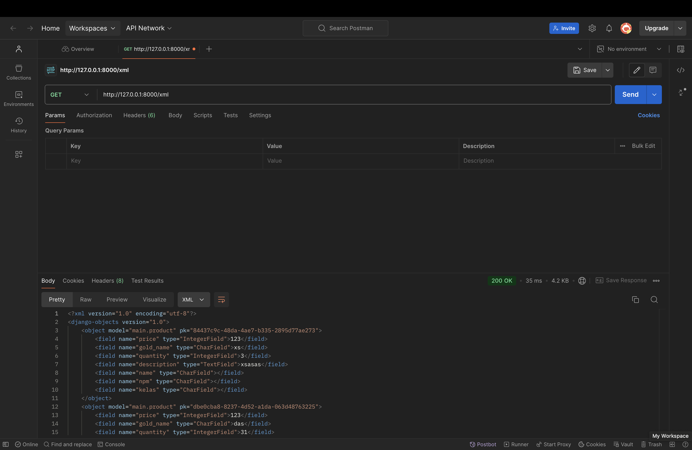
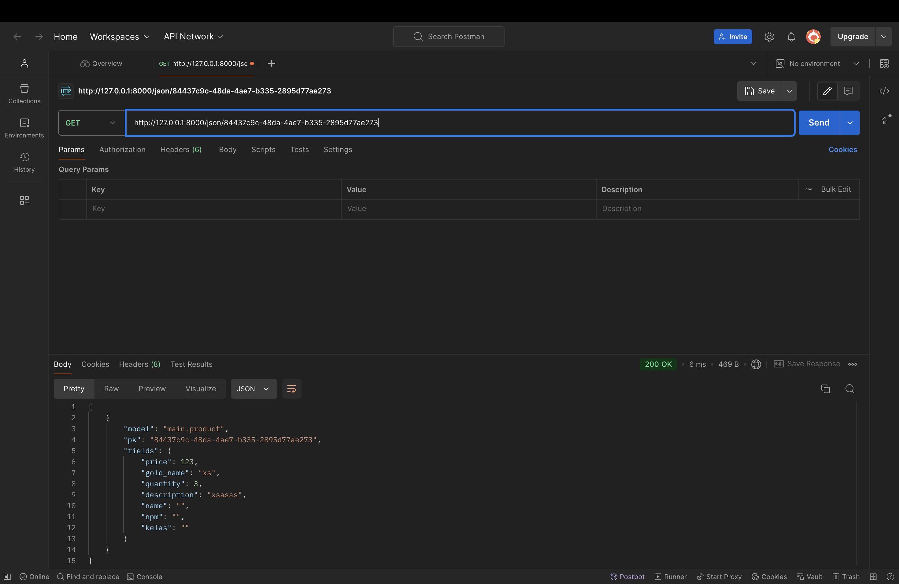
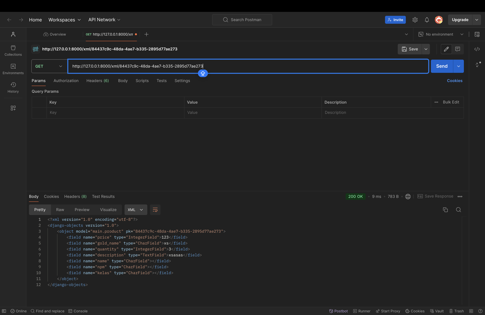

TUGAS 2

1.Pada checklist memberikan saya guide untuk membuat sebuah website mulai dari awal sampai deployment 
- pertama saya membuat project django baru dengan mendownload seluruh property yang diperlukan dan menggunakan virutal enviroment
- Pada directory yang sama, saya membuat file txt baru yang berisi daftar dependencies yang akan diinstall(Hal ini dilakukan agar dapat mengautomatisasi penginstallan semua dependencies yang harus diinstall)
- lalu saya menjalankan pip install -r requirements.txt untuk menginstall semua dependencies yang terdaftar di requirements.txt
- Saya juga menambahkan ""localhost", "127.0.0.1" pada bagian ALLOWED_HOSTS di file settings.py
-  Saya juga membuat file ".gitignore" agar file yang tidak perlu akan diabaikan nantinya  

- selanjutnya saya membuat main page website saya dengan membuat file main dengan kerangka html
- Dalam folder jual, kita harus menambahkan path('', include('main.urls')),pada bagian url_patterns di dalam file urls.py
- setelah itu saya mengganti beberapa komponen pada views.py untuk mengubah hal hal yang mau saya adakan pada pada website saya seperti : - nama (Charfield), quantity (Integerfield), description(TextField), price (Intergerfield)
- lalu saya melakukan integrasi terhadap main saya dan saya sesuaikan dengan komponen yang sudah saya ubah pada view.py
- saya juga melakukan routing pada urls.py agar dapat terintegrasi dengan main saya
- dan yang terkahir saya melakukan commit pada github dan juga deployment website saya pada PWS
2. link untuk bangan : https://www.canva.com/design/DAGQUyJfBOE/Gn-rtXkHpZ6i-6RMrRyP3Q/edit?utm_content=DAGQUyJfBOE&utm_campaign=designshare&utm_medium=link2&utm_source=sharebutton
3. fungsi git:
    1. melakukan tracking jika ada perubahan kode
    2. melakukan tracking siapa saja yang melakukan perubahan pada kode
    3. memfasilitasi para programmer untuk melakukan collaboration
4. karena django sudah memiliki komunitas yang besar dan juga sudah diapaki oleh bnayak orang yang dimana dapat emmudahkan kami pelajar untuk melakukan search dan membantu kita jika kita mendapatkan bug 
5. model django disebut juga ORM (Object-Relation-Mapping) karena django menggunakan teknik ORM mengubungkan objek pada pythondengan tabel tabel dalam database relational.

TUGAS 3 

1. Data delivery adalah proses krusial dalam sebuah platform, baik  platform web, aplikasi mobile. Proses ini melibatkan pengiriman data dari satu titik ke titik lainnya, baik itu antar komponen dalam platform itu sendiri, maupun antara platform dengan sistem eksternal.
ada beberapa alasana kenapa data delivery sangat penting:
    - Interaksi Pengguna: Data delivery memungkinkan pengguna berinteraksi dengan platform.
    - Pembarui data : dapat memperbahrui data secara berkala 
    - intergarasi sistem 
    - analisis data
- Sebagai konkulis Data delivery adalah tulang punggung dari setiap platform. Tanpa data delivery, platform tidak akan dapat berfungsi dengan baik dan memberikan nilai bagi penggunanya. Oleh karena itu, pemilihan teknologi dan arsitektur data delivery yang tepat sangat penting untuk memastikan kinerja, skalabilitas, dan keamanan platform.

2. JSON dan XML adalah representasi data yang digunakan dalam pertukaran data antaraplikasi. JSON adalah format pertukaran data terbuka yang dapat dibaca baik oleh manusia maupun mesin. JSON bersifat independen dari setiap bahasa pemrograman dan merupakan output API umum dalam berbagai aplikasi. XML adalah bahasa markah yang menyediakan aturan untuk menentukan data apa pun. XML menggunakan tanda untuk membedakan antara atribut data dan data aktual. Meskipun kedua format tersebut digunakan dalam pertukaran data, JSON adalah opsi yang lebih baru, lebih fleksibel, dan lebih populer. Menurut saya  lebih baik JSON karena lebih readable dibandingkan dengan XML
sebagai penjelasan tambahan  : 
XML (eXtensible Markup Language): Merupakan bahasa markup yang digunakan untuk mendefinisikan struktur data.
JSON (JavaScript Object Notation): Adalah format pertukaran data yang ringan dan mudah dibaca.
Mengapa JSOn lebih populer ada beberapa alasan:
    - kesedrhanaan : sintaks dalam JSON lebih sederhana yang membuatnya lebih mudah dibaca dibanding XML
    - effisiensi : Ukuran File JSON umumnya lebih kecil dibandingkan file XML yang setara, sehingga waktu transfer data menjadi lebih cepat.

3. Fungsi ""is valid()"" pada django adalah untuk memvalidasi dan memastikan data yang telah diinputkan pengguna melalui formulir.
Ketika sebuah formulir dikirimkan, Django yang akan memanggil metode ini untuk memeriksa apakah semua data yang dimasukkan sudah benar dan memenuhi persyaratan validasi yang telah ditetapkan.

4.  adalah token yang berfungsi sebagai security. Token ini di-generate secara otomatis oleh Django untuk mencegah serangan berbahaya.
Kenapa PWS penting:
    - Mencegah Aksi yang Tidak Diinginkan: Dengan menambahkan csrf_token ke dalam form, Django dapat memverifikasi bahwa permintaan yang dikirimkan berasal dari halaman yang sama di mana formulir itu ditampilkan, dan bukan dari halaman lain yang disusupi oleh penyerang.
    - Meningkatkan Keamanan Aplikasi: Serangan CSRF dapat menyebabkan konsekuensi yang serius, seperti mengubah kata sandi pengguna, melakukan transaksi tanpa izin, atau bahkan menghapus data penting. Dengan menggunakan csrf_token, kita dapat melindungi aplikasi dari jenis serangan ini.
Apa yang terjadi jika tidak menambah : 
    - Jika kita tidak menambahkan csrf_token ke dalam form, maka penyerang dapat membuat formulir palsu yang terlihat persis sama dengan formulir asli, tetapi dengan action yang berbeda. 
Bagaimana Penyerang Memanfaatkan CSRF : 
    - Formulir Palsu Penyerang dapat membuat formulir palsu yang tersembunyi di dalam sebuah gambar atau iframe yang dibenamkan di halaman web yang tidak berbahaya
    - Link Jahat Penyerang dapat membuat link yang berisi permintaan POST yang sudah diformat dengan baik.

5. 
    1. Membuat forms.py di direktori main dengan isi
        from django.forms import ModelForm
        from main.models import Product
        class ProductEntryForm(ModelForm):
            class Meta:
                model = Product  #bisa jadi salah disini
                fields = ["gold_name", "price", "quantity", "description"]

    2. Menambahkan Method create_product_entry untuk menambah entri database di file views.py di direktori main
            def create_product_entry(request):
            form = ProductEntryForm(request.POST or None)
                if form.is_valid() and request.method == "POST":
                    form.save()
                    return redirect("main:show_main")
                context = {
                    "form": form
                }
            return render(request, "create_product.html", context)

    3. Mengimplementasikan form yang tadi sudah dibuat ke dalam laman baru dengan template html yang baru create_product.html

    4. Menambahkan lokasi folder templates tersebut ke settings.py di direktori jual_emas
        ...
        'DIRS': [BASE_DIR / 'templates'],
        ...
    5. Mengimplementasikan database ke dalam page utama main.html dan juga menjadi perpanjangan dari base.html di direktori utama

    6. Menggunakan folder static untuk mengorganisir aset yang digunakan seperti gambar.
    
    7. Menambahkan fungsi-fungsi yang diperlukan untuk menampilkan JSON dan XML baik secara keseluruhan maupun per entri database
        def show_xml (request):
        data = Product.objects.all()
        return HttpResponse(serializers.serialize("xml", data), content_type="application/xml")

        def show_json(request):
            data= Product.objects.all()
            return HttpResponse(serializers.serialize("json", data), content_type="application/json")

        def show_xml_by_id(request, id):
            data_id = Product.objects.filter(pk=id)  # Use the id argument passed to the function
            return HttpResponse(serializers.serialize("xml", data_id), content_type="application/xml")

        def show_json_by_id(request, id):
            data_id = Product.objects.filter(pk=id)  # Use the id argument passed to the function
            return HttpResponse(serializers.serialize("json", data_id), content_type="application/json")

    8. Merouting kembali URL yang bersangkutan di file urls.py
    path('', views.show_main, name='show_main'),
    path('create_product_entry', create_product_entry, name='create_product_entry'),
    path('xml/', show_xml, name='show_xml'),
    path ('json/', show_json, name='show_json'),
    path('xml/<str:id>/', show_xml_by_id, name='show_xml_by_id'),
    path('json/<str:id>/', show_json_by_id, name='show_json_by_id'),

!!! DOKUMENTASI !!!

JSON 

XML

JSON_ID

XML_ID

=====================================
TUGAS 4 
=====================================

1. - HttpResponseRedirect() adalah class yang secara langsung menghasilkan respons HTTP untuk di redirect.  HttpResponseRedirect() memiliki fungsi untuk menerima sebuah URL sebagai argumen dan mengembalikan objek respons yang memberi tahu browser kita untuk mengalihkan user ke URL tersebut. HttpResponseRedirect()  juga memiliki fleksibilitas yang tinggi yang memungkinkan untuk mengkostumisasi respons dan HttpResponseRedirect() digunakan ketika kita ingin memiliki kontrol penuh pada URL kita dan dapat diinstansiasi secara langsung dengan cara paste URL yang kita mau redirect.
- redirect() adalah fungsi shortcut yang lebih ringkas dan lebih mudah daripada HttpResponseRedirect(). Namun fungsi dari redirect() membungkus HttpResponseRedirect()  dan menyediakan UI yang lebih sederhana.  Umunya programmer memakai redirect() untuk proses pengalihan karena lebih mudah dibaca dan juga lebih mudah ditulis.

2. Menghubungkan model dengan user
Menambhakn import yang diperlukan pada models.py seperti from django.contrib.auth.models import User
Dan menambahkan class Product(models.Model): # model ini akan membuat table di database dengan nama Product
   user = models.ForeignKey(User, on_delete=models.CASCADE)

Merrubah beberapa kompenen pada view.py di bagian create_product
Mengubah value pada product_entries 
Melakuakan make migration dan melakukan migrate
Dan yang terakhir pada setting.py saya melakukan import os dan manganti debug menjadi 
    PRODUCTION = os.getenv("PRODUCTION", False)
    DEBUG = not PRODUCTION

3. 1. Authorization:
    Authorization adalah process yang dimana akan menentukan apa yang user dapat lakukan pada sistem. Authorization menjelaskan mengenai permission dan acces yang diperbolehkan untuk user lakukan pada sistem
	2. Authentication
		Authentication adalah proses dimana dilakukanya proses verifikasi identitas dari user ataupun sistem, untuk memastikan bahwa yang dapat mengakses benar benar yang sudah disetujui.
	
    Django menyediakan kerangka kerja yang kuat untuk menangani otentikasi dan otorisasi dengan mudah. Berikut adalah cara kerjanya:
    Sistem authentication
    Model Pengguna: User adalah model bawaan yang menyimpan informasi pengguna seperti username, password,email, dan izin.
    Autentikasi: Fungsi authenticate() memeriksa kredensial pengguna untuk memverifikasi identitasnya.
    Sistem authorization
    
    Izin: Izin diberikan kepada pengguna atau kelompok pengguna untuk mengontrol akses ke fitur atau data tertentu.
    Pemeriksaan Izin: Metode seperti user.has_perm() atau user.has_perms() digunakan untuk memeriksa apakah pengguna memiliki izin tertentu.

    Authentication memastikan siapa pengguna, sedangkan authorization menentukan apa yang dapat dilakukan oleh pengguna tersebut. Django menggabungkan kedua fungsionalitas ini dalam sistem otentikasinya, sehingga pengembang dapat menerapkan mekanisme otentikasi dan otorisasi yang aman dengan mudah.

4. Django menggunakan session untuk mengingat pengguna yang telah login. Saat pengguna berhasil login, Django akan membuat sebuah session yang unik dan menyimpannya sebagai cookie di browser pengguna. Cookie ini berisi sebuah kunci session yang merujuk ke data session yang disimpan di server. Prosesnya: 
 Pengguna login : saat pengguna login dan memasukan username dan password yang benar, maka django akan membuat session baru.
Cookie Session : Django akan mengirimkan cookie session pada browser pengguna. Cookie ini berisi sebuah kunci unik yang dapat mengidentifikasi session tersebut.
Selanjutnya setiap kali pengunna melakukan permintaan ke server, maka browser akan mengirimkan cookiesnya session lagi
Lalu django akan memeriksa apakah kuci session yang dikirimkan valid dan jika ditemukan, maka django akan mengetahui bahwa pengguna tersebut sudah pernah login dan data sudah tersimpan pada cookie session tersebut.
	Dilain sisi tidak semua cookies aman digunakan, karena ada beberapa hal yang harus diperhatikan ketika mengakses cookie terutama dalam sistem keamanan.
5. Proses Implementasi checklist secara step by step
    - Membuat fitur Login dan logout:
    Menambahkan import import yang diperlukan seperti from django.contrib.auth.forms import UserCreationForm, AuthenticationForm, from django.contrib.auth, import authenticate, login,from django.contrib.auth import logout,from main.views import logout_user
    Lalu menambahkan beberapa fungsi pada views.py seperti login_user dan logout_user
    - Selanjutnya saya membuat HTML baru yaitu login.html  dimana akan menjadi sistem pertama yang akan dilakukan oleh sistem 
    Melakukan routing url seperti biasa untuk mengatur alur tampilan laman
    Menampilkan last login pada halaman utama
    Menambahkan import yang diperlukan 
    Menambah beberapa komponen pada login user dan menambahkan response untuk membuat responsive pada html saya yang saya tambahkan response = HttpResponseRedirect(reverse("main:show_main")) untuk membuat response
    response.set_cookie('last_login', str(datetime.datetime.now())) berfungsi untuk membuat cookie last_login dan menambahkannya ke dalam response
    alu pada show main saya menambahkan 'last_login': request.COOKIES['last_login'] berfungsi menambahkan informasi cookie last_login pada response yang akan ditampilkan di halaman web, pada context
    - Menghubungkan model dengan user
    Menambhakn import yang diperlukan pada models.py seperti from django.contrib.auth.models import User
    Dan menambahkan class Product(models.Model): # model ini akan membuat table di database dengan nama Product
    user = models.ForeignKey(User, on_delete=models.CASCADE)

    Merubah beberapa komponen pada view.py di bagian create_product
    Mengubah value pada product_entries 
    Melakukan make migration dan melakukan migrate
    Dan yang terakhir pada setting.py saya melakukan import os dan manganti debug menjadi 
    PRODUCTION = os.getenv("PRODUCTION", False)
    DEBUG = not PRODUCTION

		

