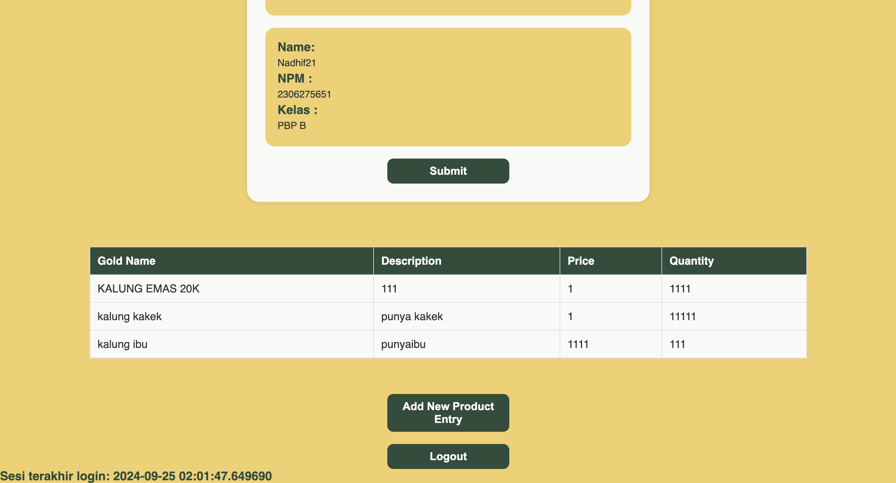
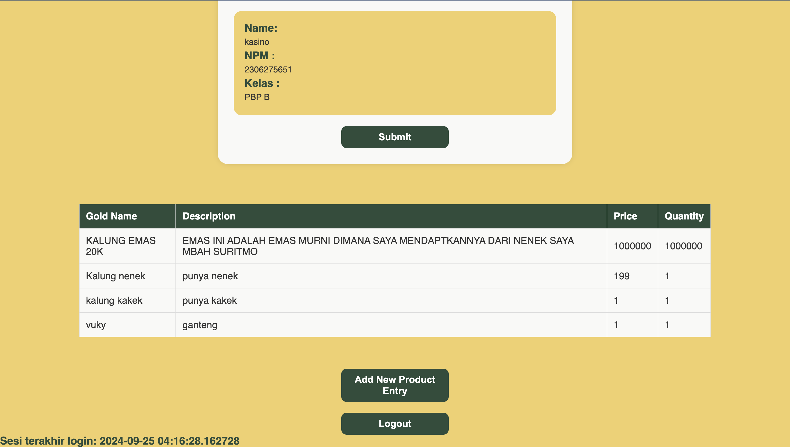

TUGAS 2

1.Pada checklist memberikan saya guide untuk membuat sebuah website mulai dari awal sampai deployment 
- pertama saya membuat project django baru dengan mendownload seluruh property yang diperlukan dan menggunakan virutal enviroment
- Pada directory yang sama, saya membuat file txt baru yang berisi daftar dependencies yang akan diinstall(Hal ini dilakukan agar dapat mengautomatisasi penginstallan semua dependencies yang harus diinstall)
- lalu saya menjalankan pip install -r requirements.txt untuk menginstall semua dependencies yang terdaftar di requirements.txt
- Saya juga menambahkan ""localhost", "127.0.0.1" pada bagian ALLOWED_HOSTS di file settings.py
-  Saya juga membuat file ".gitignore" agar file yang tidak perlu akan diabaikan nantinya  

- selanjutnya saya membuat main page website saya dengan membuat file main dengan kerangka html
- Dalam folder jual, kita harus menambahkan path('', include('main.urls')),pada bagian url_patterns di dalam file urls.py
- setelah itu saya mengganti beberapa komponen pada views.py untuk mengubah hal hal yang mau saya adakan pada pada website saya seperti : - nama (Charfield), quantity (Integerfield), description(TextField), price (Intergerfield)
- lalu saya melakukan integrasi terhadap main saya dan saya sesuaikan dengan komponen yang sudah saya ubah pada view.py
- saya juga melakukan routing pada urls.py agar dapat terintegrasi dengan main saya
- dan yang terkahir saya melakukan commit pada github dan juga deployment website saya pada PWS
2. link untuk bangan : https://www.canva.com/design/DAGQUyJfBOE/Gn-rtXkHpZ6i-6RMrRyP3Q/edit?utm_content=DAGQUyJfBOE&utm_campaign=designshare&utm_medium=link2&utm_source=sharebutton
3. fungsi git:
    1. melakukan tracking jika ada perubahan kode
    2. melakukan tracking siapa saja yang melakukan perubahan pada kode
    3. memfasilitasi para programmer untuk melakukan collaboration
4. karena django sudah memiliki komunitas yang besar dan juga sudah diapaki oleh bnayak orang yang dimana dapat emmudahkan kami pelajar untuk melakukan search dan membantu kita jika kita mendapatkan bug 
5. model django disebut juga ORM (Object-Relation-Mapping) karena django menggunakan teknik ORM mengubungkan objek pada pythondengan tabel tabel dalam database relational.


TUGAS 3 

1. Data delivery adalah proses krusial dalam sebuah platform, baik  platform web, aplikasi mobile. Proses ini melibatkan pengiriman data dari satu titik ke titik lainnya, baik itu antar komponen dalam platform itu sendiri, maupun antara platform dengan sistem eksternal.
ada beberapa alasana kenapa data delivery sangat penting:
    - Interaksi Pengguna: Data delivery memungkinkan pengguna berinteraksi dengan platform.
    - Pembarui data : dapat memperbahrui data secara berkala 
    - intergarasi sistem 
    - analisis data
- Sebagai konkulis Data delivery adalah tulang punggung dari setiap platform. Tanpa data delivery, platform tidak akan dapat berfungsi dengan baik dan memberikan nilai bagi penggunanya. Oleh karena itu, pemilihan teknologi dan arsitektur data delivery yang tepat sangat penting untuk memastikan kinerja, skalabilitas, dan keamanan platform.

2. JSON dan XML adalah representasi data yang digunakan dalam pertukaran data antaraplikasi. JSON adalah format pertukaran data terbuka yang dapat dibaca baik oleh manusia maupun mesin. JSON bersifat independen dari setiap bahasa pemrograman dan merupakan output API umum dalam berbagai aplikasi. XML adalah bahasa markah yang menyediakan aturan untuk menentukan data apa pun. XML menggunakan tanda untuk membedakan antara atribut data dan data aktual. Meskipun kedua format tersebut digunakan dalam pertukaran data, JSON adalah opsi yang lebih baru, lebih fleksibel, dan lebih populer. Menurut saya  lebih baik JSON karena lebih readable dibandingkan dengan XML
sebagai penjelasan tambahan  : 
XML (eXtensible Markup Language): Merupakan bahasa markup yang digunakan untuk mendefinisikan struktur data.
JSON (JavaScript Object Notation): Adalah format pertukaran data yang ringan dan mudah dibaca.
Mengapa JSOn lebih populer ada beberapa alasan:
    - kesedrhanaan : sintaks dalam JSON lebih sederhana yang membuatnya lebih mudah dibaca dibanding XML
    - effisiensi : Ukuran File JSON umumnya lebih kecil dibandingkan file XML yang setara, sehingga waktu transfer data menjadi lebih cepat.

3. Fungsi ""is valid()"" pada django adalah untuk memvalidasi dan memastikan data yang telah diinputkan pengguna melalui formulir.
Ketika sebuah formulir dikirimkan, Django yang akan memanggil metode ini untuk memeriksa apakah semua data yang dimasukkan sudah benar dan memenuhi persyaratan validasi yang telah ditetapkan.

4.  adalah token yang berfungsi sebagai security. Token ini di-generate secara otomatis oleh Django untuk mencegah serangan berbahaya.
Kenapa PWS penting:
    - Mencegah Aksi yang Tidak Diinginkan: Dengan menambahkan csrf_token ke dalam form, Django dapat memverifikasi bahwa permintaan yang dikirimkan berasal dari halaman yang sama di mana formulir itu ditampilkan, dan bukan dari halaman lain yang disusupi oleh penyerang.
    - Meningkatkan Keamanan Aplikasi: Serangan CSRF dapat menyebabkan konsekuensi yang serius, seperti mengubah kata sandi pengguna, melakukan transaksi tanpa izin, atau bahkan menghapus data penting. Dengan menggunakan csrf_token, kita dapat melindungi aplikasi dari jenis serangan ini.
Apa yang terjadi jika tidak menambah : 
    - Jika kita tidak menambahkan csrf_token ke dalam form, maka penyerang dapat membuat formulir palsu yang terlihat persis sama dengan formulir asli, tetapi dengan action yang berbeda. 
Bagaimana Penyerang Memanfaatkan CSRF : 
    - Formulir Palsu Penyerang dapat membuat formulir palsu yang tersembunyi di dalam sebuah gambar atau iframe yang dibenamkan di halaman web yang tidak berbahaya
    - Link Jahat Penyerang dapat membuat link yang berisi permintaan POST yang sudah diformat dengan baik.

5. 
    1. Membuat forms.py di direktori main dengan isi
        from django.forms import ModelForm
        from main.models import Product
        class ProductEntryForm(ModelForm):
            class Meta:
                model = Product  #bisa jadi salah disini
                fields = ["gold_name", "price", "quantity", "description"]

    2. Menambahkan Method create_product_entry untuk menambah entri database di file views.py di direktori main
            def create_product_entry(request):
            form = ProductEntryForm(request.POST or None)
                if form.is_valid() and request.method == "POST":
                    form.save()
                    return redirect("main:show_main")
                context = {
                    "form": form
                }
            return render(request, "create_product.html", context)

    3. Mengimplementasikan form yang tadi sudah dibuat ke dalam laman baru dengan template html yang baru create_product.html

    4. Menambahkan lokasi folder templates tersebut ke settings.py di direktori jual_emas
        ...
        'DIRS': [BASE_DIR / 'templates'],
        ...
    5. Mengimplementasikan database ke dalam page utama main.html dan juga menjadi perpanjangan dari base.html di direktori utama

    6. Menggunakan folder static untuk mengorganisir aset yang digunakan seperti gambar.
    
    7. Menambahkan fungsi-fungsi yang diperlukan untuk menampilkan JSON dan XML baik secara keseluruhan maupun per entri database
        def show_xml (request):
        data = Product.objects.all()
        return HttpResponse(serializers.serialize("xml", data), content_type="application/xml")


        def show_json(request):
            data= Product.objects.all()
            return HttpResponse(serializers.serialize("json", data), content_type="application/json")

        def show_xml_by_id(request, id):
            data_id = Product.objects.filter(pk=id)  # Use the id argument passed to the function
            return HttpResponse(serializers.serialize("xml", data_id), content_type="application/xml")

        def show_json_by_id(request, id):
            data_id = Product.objects.filter(pk=id)  # Use the id argument passed to the function
            return HttpResponse(serializers.serialize("json", data_id), content_type="application/json")

    8. Merouting kembali URL yang bersangkutan di file urls.py
    path('', views.show_main, name='show_main'),
    path('create_product_entry', create_product_entry, name='create_product_entry'),
    path('xml/', show_xml, name='show_xml'),
    path ('json/', show_json, name='show_json'),
    path('xml/<str:id>/', show_xml_by_id, name='show_xml_by_id'),
    path('json/<str:id>/', show_json_by_id, name='show_json_by_id'),


!!! DOKUMENTASI !!!


JSON 

XML

JSON_ID

XML_ID


=====================================
TUGAS 4 
=====================================


1. - HttpResponseRedirect() adalah class yang secara langsung menghasilkan respons HTTP untuk di redirect.  HttpResponseRedirect() memiliki fungsi untuk menerima sebuah URL sebagai argumen dan mengembalikan objek respons yang memberi tahu browser kita untuk mengalihkan user ke URL tersebut. HttpResponseRedirect()  juga memiliki fleksibilitas yang tinggi yang memungkinkan untuk mengkostumisasi respons dan HttpResponseRedirect() digunakan ketika kita ingin memiliki kontrol penuh pada URL kita dan dapat diinstansiasi secara langsung dengan cara paste URL yang kita mau redirect.
- redirect() adalah fungsi shortcut yang lebih ringkas dan lebih mudah daripada HttpResponseRedirect(). Namun fungsi dari redirect() membungkus HttpResponseRedirect()  dan menyediakan UI yang lebih sederhana.  Umunya programmer memakai redirect() untuk proses pengalihan karena lebih mudah dibaca dan juga lebih mudah ditulis.

2. Menghubungkan model dengan user
Menambhakn import yang diperlukan pada models.py seperti from django.contrib.auth.models import User
Dan menambahkan class Product(models.Model): # model ini akan membuat table di database dengan nama Product
   user = models.ForeignKey(User, on_delete=models.CASCADE)

Merrubah beberapa kompenen pada view.py di bagian create_product
Mengubah value pada product_entries 
Melakuakan make migration dan melakukan migrate
Dan yang terakhir pada setting.py saya melakukan import os dan manganti debug menjadi 
    PRODUCTION = os.getenv("PRODUCTION", False)
    DEBUG = not PRODUCTION


3. 1. Authorization:
    Authorization adalah process yang dimana akan menentukan apa yang user dapat lakukan pada sistem. Authorization menjelaskan mengenai permission dan acces yang diperbolehkan untuk user lakukan pada sistem
	2. Authentication
		Authentication adalah proses dimana dilakukanya proses verifikasi identitas dari user ataupun sistem, untuk memastikan bahwa yang dapat mengakses benar benar yang sudah disetujui.
	
    Django menyediakan kerangka kerja yang kuat untuk menangani otentikasi dan otorisasi dengan mudah. Berikut adalah cara kerjanya:
    Sistem authentication
    Model Pengguna: User adalah model bawaan yang menyimpan informasi pengguna seperti username, password,email, dan izin.
    Autentikasi: Fungsi authenticate() memeriksa kredensial pengguna untuk memverifikasi identitasnya.
    Sistem authorization

    Izin: Izin diberikan kepada pengguna atau kelompok pengguna untuk mengontrol akses ke fitur atau data tertentu.
    Pemeriksaan Izin: Metode seperti user.has_perm() atau user.has_perms() digunakan untuk memeriksa apakah pengguna memiliki izin tertentu.

    Authentication memastikan siapa pengguna, sedangkan authorization menentukan apa yang dapat dilakukan oleh pengguna tersebut. Django menggabungkan kedua fungsionalitas ini dalam sistem otentikasinya, sehingga pengembang dapat menerapkan mekanisme otentikasi dan otorisasi yang aman dengan mudah.

4. Django menggunakan session untuk mengingat pengguna yang telah login. Saat pengguna berhasil login, Django akan membuat sebuah session yang unik dan menyimpannya sebagai cookie di browser pengguna. Cookie ini berisi sebuah kunci session yang merujuk ke data session yang disimpan di server. Prosesnya: 
 Pengguna login : saat pengguna login dan memasukan username dan password yang benar, maka django akan membuat session baru.
Cookie Session : Django akan mengirimkan cookie session pada browser pengguna. Cookie ini berisi sebuah kunci unik yang dapat mengidentifikasi session tersebut.
Selanjutnya setiap kali pengunna melakukan permintaan ke server, maka browser akan mengirimkan cookiesnya session lagi
Lalu django akan memeriksa apakah kuci session yang dikirimkan valid dan jika ditemukan, maka django akan mengetahui bahwa pengguna tersebut sudah pernah login dan data sudah tersimpan pada cookie session tersebut.
	Dilain sisi tidak semua cookies aman digunakan, karena ada beberapa hal yang harus diperhatikan ketika mengakses cookie terutama dalam sistem keamanan.
5. Proses Implementasi checklist secara step by step
    - Membuat Fungsi registrasi:
    menambahkan import pada views.py
    menambahkan fungsi regis pada views.py
    membuat register.html pada direktori main
    lalu menambahkan import dan path url pada url.py
    - Membuat fitur Login dan logout:
    Menambahkan import import yang diperlukan seperti from django.contrib.auth.forms import UserCreationForm, AuthenticationForm, from django.contrib.auth, import authenticate, login,from django.contrib.auth import logout,from main.views import logout_user
    Lalu menambahkan beberapa fungsi pada views.py seperti login_user dan logout_user
    - Selanjutnya saya membuat HTML baru yaitu login.html  dimana akan menjadi sistem pertama yang akan dilakukan oleh sistem 
    Melakukan routing url seperti biasa untuk mengatur alur tampilan laman
    Menampilkan last login pada halaman utama
    Menambahkan import yang diperlukan 
    Menambah beberapa komponen pada login user dan menambahkan response untuk membuat responsive pada html saya yang saya tambahkan response = HttpResponseRedirect(reverse("main:show_main")) untuk membuat response
    response.set_cookie('last_login', str(datetime.datetime.now())) berfungsi untuk membuat cookie last_login dan menambahkannya ke dalam response
    alu pada show main saya menambahkan 'last_login': request.COOKIES['last_login'] berfungsi menambahkan informasi cookie last_login pada response yang akan ditampilkan di halaman web, pada context
    - Menghubungkan model dengan user
    Menambhakn import yang diperlukan pada models.py seperti from django.contrib.auth.models import User
    Dan menambahkan class Product(models.Model): # model ini akan membuat table di database dengan nama Product
    user = models.ForeignKey(User, on_delete=models.CASCADE)

    - Merubah beberapa komponen pada view.py di bagian create_product
    Mengubah value pada product_entries 
    Melakukan make migration dan melakukan migrate
    Dan yang terakhir pada setting.py saya melakukan import os dan manganti debug menjadi 
    PRODUCTION = os.getenv("PRODUCTION", False)
    DEBUG = not PRODUCTION

===============
BUKTI
===============
AKUN1

AKUN2



# TUGAS 5
======================================
## 1 
1. Dalam CSS, ketika beberapa selector diterapkan pada elemen yang sama, spesifisitas digunakan untuk menentukan gaya mana yang berlaku. Semakin tinggi spesifisitas, semakin besar kemungkinannya untuk diterapkan pada elemen tersebut. Berikut adalah urutan prioritas selector CSS, dari yang tertinggi hingga terendah:

### inline Styles 
 Inline Styles (Gaya Langsung di Elemen) Gaya yang diterapkan langsung pada elemen melalui atribut style memiliki prioritas tertinggi.

``Contoh: <div style="color: blue ;">this teks is blue</div>
``

Prioritas: Inline style mengabaikan gaya yang ditetapkan oleh ID, class, atau elemen selector lainnya.

### ID SELECTOR
ID Selectors (Selector Berdasarkan ID) Selector ini menggunakan atribut id dari elemen HTML. Karena id harus unik, spesifisitasnya cukup tinggi.

``Contoh: #judul { color: blue; } akan mempengaruhi elemen dengan ID "judul".
``

Prioritas: Lebih tinggi dari selector class dan elemen.

### Class Selector
Class Selectors (Selector Berdasarkan Class) Selector ini menggunakan atribut class yang dapat diterapkan ke beberapa elemen.

``Contoh: .konten { margin: 20px; } akan mempengaruhi semua elemen dengan class "konten".
``

Prioritas: Lebih tinggi dari selector elemen, tetapi lebih rendah dari ID.

### Element Selector 
Element Selectors (Selector Berdasarkan Elemen) Selector ini hanya berdasarkan elemen HTML seperti div, p atau h1. Spesifisitasnya paling rendah.

``
Contoh: p { color: green; } akan mempengaruhi semua elemen paragraf (<p>).
``

Element Selectors (Selector Berdasarkan Elemen) Selector ini hanya berdasarkan elemen HTML seperti div, p atau h1. Spesifisitasnya paling rendah.

Prioritas: Ini memiliki spesifisitas terendah dibandingkan ID dan class selector.

## 2
2. Responsive design sangat penting dalam aplikasi web karena dengan mengimplementasikan responsive design memungkinkan web kita untuk beradaptasi dengan berbagai ukuran dari gadget yang kita pakai, seperti desktop dan mobile.

contoh: 

X 
		Twitter memiliki desain responsif yang sangat baik. Saat dibuka di desktop, smartphone, tata letaknya akan otomatis menyesuaikan dan memberikan pengalaman pengguna yang konsisten

airbnb
Situs dan aplikasinya secara otomatis menyesuaikan ukuran gambar, menu, dan teks agar mudah dibaca di semua perangkat.

**Yang Tidak Menggunakan**

Situs lama 
banyak situs pemerintah lama (baik lokal maupun internasional) belum menerapkan desain responsif, sehingga tampilannya tidak optimal di perangkat mobile. Pengguna sering kali harus memperbesar layar dan menggeser untuk membaca konten

## 3 
Margin 
- bagian luar yang memisahkan elemen tersebut dengan elemen lainya 
- tidak mempengaruhi ukuran elemen, hanya menambah jarak diluar 

    - margin-top
    - margin-right
    - margin-bottom
    - margin-left
    - margin (shorthand untuk semua sisi)

Border 
- Garis yang mengelilingi elemen
- mempengaruhi elemen tp tidak mengubah ukuran elemen

Padding 
- Ruang antar boder dan elemen
- mengubah besar kecilnya elemen tanpa mempengaruhi border dan margin

    - padding-top
    - padding-right
    - padding-bottom
    - padding-left

## 4 
**FLexbox**
Flexbox (Flexible Box Layout) adalah modul tata letak CSS yang dirancang untuk memudahkan pengaturan dan penempatan elemen dalam sebuah kontainer, terutama untuk elemen-elemen yang berubah ukuran secara dinamis.

Kegunaan:
- menyusun elemen secara horizontal atau vertikal dengan mudah 
- mengatur jarak antar elemen
- Fleksibel dalam mengubah ukuran elemen agar sesuai dengan ukuran kontainer.

Contoh Kegunaan 

```python
.container {
  display: flex;
  justify-content: space-between; #Menyebar elemen secara merata
  align-items: center;  #Vertikal rata tengah 
}

.item {
  flex: 1; # Elemen ini akan menyesuaikan ukurannya secara fleksibel 
}
```

**CSS GRID**  adalah sistem tata letak dua dimensi yang memungkinkan kita untuk menyusun elemen dalam baris dan kolom. Grid memberi kontrol yang lebih detail dibandingkan Flexbox dalam mengatur tata letak kompleks.
Kegunaan:
Memudahkan pembuatan layout yang rumit seperti grid berbasis kolom dan baris.
Mengatur posisi elemen dengan lebih presisi, baik secara horizontal maupun vertikal.
 
```python
.container {
  display: grid;
  grid-template-columns: 1fr 2fr 1fr; #3 kolom dengan lebar proporsional */
  grid-gap: 10px; # Jarak antar kolom/baris */
}

.item1 {
  grid-column: 1 / 3; # Elemen ini akan mengisi kolom 1 sampai 2 */
}

.item2 {
  grid-row: 2 / 4; # Elemen ini akan mengisi baris 2 sampai 3 */
}
```

## 5 

1. Menambahkan tailwind pada aplikasi dengan memasukan 
```python
<script src="https://cdn.tailwindcss.com">
``` 
pada base.html

2. Menambahkan Edit dan delete pada views.py, url.py, dan main.html dan juga melakukan penambahan import 

3. Membuat Nav Bar yang seperti s=diminta dengan memahammi konsep tailwind seperti yang dicontohkan pad tutorial 

4. Melakiukan konfigurasi static pada settings.py

5. Lalu melakukan desain pada setiap HTML yang ada menggunakan tailwind agar lebih menarik
contoh


```python




<title>Create Product Entry</title>





<div class="flex flex-col min-h-screen bg-[#F5F5DC]"> <!-- Cream background -->
  <div class="container mx-auto px-4 py-8 mt-16 max-w-xl">
    <h1 class="text-3xl font-bold text-center mb-8 text-[#6A1B47]">Create Product Entry</h1> <!-- Burgundy text -->
  
    <div class="bg-white shadow-md rounded-lg p-6 form-style">
      <form method="POST" class="space-y-6">
        
        
          <div class="flex flex-col">
            <label for="{{ field.id_for_label }}" class="mb-2 font-semibold text-[#6A1B47]"> <!-- Burgundy label -->
              {{ field.label }}
            </label>
            <div class="w-full">
              {{ field }}
            </div>
            
              <p class="mt-1 text-sm text-gray-500">{{ field.help_text }}</p>
            
            
              <p class="mt-1 text-sm text-red-600">{{ error }}</p>
            
          </div>
        
        <div class="flex justify-center mt-6">
          <button type="submit" class="bg-[#6A1B47] text-white font-semibold px-6 py-3 rounded-lg hover:bg-[#822659] transition duration-300 ease-in-out w-full"> <!-- Burgundy button -->
            Create Product Entry
          </button>
        </div>
      </form>
    </div>
  </div>
</div>


```


# TUGAS 6
=========================

## 1 
"JAVASCRIPT" adalah scripting language yang memberikan kita kemudahan untuk membuat konten, mengontrol media seperti foto, animasi, video dll secara dinamis. Javascript memerankan peran penting dalam web develpoment dengan memberikan banyak sekali benefit seperti fungsionalitas, sistem yang interaktif dan overall user experience

Beberapa manfaat dari JavaScript dalam pengembangan aplikasi web adalah:
 - Enhanced Interactivity : Javascript memungkinkan web developer membuat web yang lebih interaktif dan juga dinamis. Fitur-fitur seperti menu dropdown, window modal, dan updated konten secara real-time membantu webdev dalam meningkatkan keterlibatan user.
 - User Experience : Dengan JavaScript, developer dapat mengimplementasikan operasi asinkron menggunakan AJAX yang memungkinkan data dimuat di latar belakang tanpa mengganggu dengan halaman user. Ini menghasilkan pengalaman yang lebih lancar, dan membuat konten lebih dinamis.
 - Fleksibelitas : Selain halaman web, JavaScript dapat digunakan untuk pemrograman sisi server melalui lingkungan seperti Node.js, Fleksibilitas ini memungkinkan developer untuk menggunakan satu bahasa di berbagai domain.
 - Memiliki fitur DOM : JavaScript memiliki fitur DOM (Document Object Model) yang memungkinkan perubahan secara real-time berdasarkan interaksi pengguna.
 - Mempermudah Developer : JavaScript juga mendukung Full Stack Development, karena dapat digunakan di sisi back-end maupun front-end. Hal ini mempermudah proses pengembangan dan deployment aplikasi.

 ## 2 
 Penggunaan await saat menggunakan fetch() merupakan hal yang sanget penting untuk memastikan bahwa kita mendapatkan hasil dari permintaan jaringan sebelum melanjutkan ke langkah berikutnya dalam kode. Ketika digunakan dengan fetch(), await memungkinkan kita untuk menunggu respons dari permintaan jaringan (network request) sebelum kita melanjutkan untuk memproses data yang diterima.
 contoh penggunaan pada kode

 ```python
 async function getProductEntries() {
    const response = await fetch("");
    return response.json();
  }

  async function refreshProductEntries() {
    const productEntries = await getProductEntries();
    let htmlString = "";
```

 ## 3
Kita menggunakan decorator @csrf_exxempt pada view yang diguanakan untuk AJAX POSST adalah untuk menghindari kesalahan CSRF dan memastikasn bahwa permintaan kita dapat dilakukan dengan benar.Biasanya @csrf_exempt digunakan juga untuk request POST digunakan saat, view kita memproses data dari servis eksternal yang tidak memiliki akses ke token CSRF, sehingga POST bisa request tanpa avalidasi CSRF. contoh pengunaan pada kode
```python 
@csrf_exempt
@require_POST
def add_product_entry_ajax(request):
    gold_name = request.POST.get('gold_name')
    description = request.POST.get('description')
    price = request.POST.get('price')
    quantity = request.POST.get('quantity')
    user = request.user

    new_product = Product(gold_name=gold_name, description=description, price=price, quantity=quantity, user=user)
    new_product.save()
    return HttpResponse(b"Product added successfully", status=201)
```

## 4 

Melakukan pembersihan data pada di backend itu adalah hal yang penting dilakukan karena lebih aman dan memastikan integritas data. Validasi di frontend bisa dilewati, sehingga backend tetap perlu melakukan pembersihan untuk melindungi aplikasi dari manipulasi atau serangan. Oleh karena itu, kita memerlukan ada pembersihan di backend (server side) agar data yang diterima tidak mengandung serangan seperti XSS dllnya.

## 5
- Menambahkan Error message pada login user
```python
messages.error(request, "Invalid username or password. Please try again.")
```
- Selanjutnya saya membuat fungsi untuk menambahkan product dengan ajax. saya melakukan 
```python
import from django.views.decorators.csrf import csrf_exempt
from django.views.decorators.http import require_POST
```
pada views.py dan saya juga membuat add product entry mengunakan ajax 
```python 
@csrf_exempt
@require_POST
def add_product_entry_ajax(request):
    gold_name = strip_tags(request.POST.get('gold_name'))
    description = strip_tags(request.POST.get('description'))
    price = strip_tags(request.POST.get('price'))
    quantity = strip_tags(request.POST.get('quantity'))
    user = request.user

    new_product = Product(gold_name=gold_name, description=description, price=price, quantity=quantity, user=user)
    new_product.save()
    return HttpResponse(b"Product added successfully", status=201)
```
dan juga setelah itu saya melanjutkan untuk melakukan import yang dibutuhkan pada urls.py

- Menampilkan Data Mood Entry dengan fetch() API: 
saya mengganti 
```python
product_entries = productEntry.objects.filter(user=request.user)
'product_entries': product_entries,
```
pada views.py dan menambahkan pada show_json dan show_xml

- Lalu saya menghapus bagian block conditional product_entries untuk menampilkan ketika kosong atau tidak. 
dan saya mengantikanya dengan 

```python
<div id="product_entry_cards"></div>
```

- Selanjutnya, saya membuat fungsi baru pada block <script> dengan nama refreshMoodEntries yang digunakan untuk me-refresh data moods secara asinkronus.

```python

  async function getProductEntries() {
    const response = await fetch("");
    return response.json();
  }

  async function refreshProductEntries() {
    const productEntries = await getProductEntries();
    let htmlString = "";
    productEntries.forEach((item)=>{
        const product = DOMPurify.sanitize(item);
    })

    if (productEntries.length === 0) {
      htmlString = `
        <div class="flex flex-col items-center justify-center min-h-[24rem] p-6">
          <p class="text-center text-gray-600 mt-4">No product data available.</p>
        </div>
      `;
    } else {
      productEntries.forEach(product => {
        htmlString += `
          <div class="product-card bg-burgundy text-cream rounded-lg p-6 shadow-lg">
            <h3 class="text-lg font-bold">Gold Name: ${product.fields.gold_name}</h3>
            <p class="mt-2">Quantity: ${product.fields.quantity}</p>
            <p class="mt-4 font-bold">Description:</p>
            <p>${product.fields.description}</p>
            <p class="mt-4 font-bold">Price:</p>
            <p>${product.fields.price}</p>
            <div class="action-buttons mt-6 flex justify-between">
              <a href="/edit-product/${product.pk}" class="bg-yellow-500 text-white px-4 py-2 rounded">Edit</a>
              <a href="/delete-product/${product.pk}" class="bg-red-500 text-white px-4 py-2 rounded">Delete</a>
            </div>
          </div>
        `;
      });
    }

    document.getElementById("product_entry_cards").innerHTML = htmlString;
  }

  ```

  - lalu saya membuat modal sebagai form untuk menambah product 
  dan juga merubah beberapa kode dalam add product dan add product by ajax
```python
async function addProductEntry() {
    const form = document.getElementById('productEntryForm');
    const formData = new FormData(form);

    await fetch("", {
      method: "POST",
      body: formData,
    });

    form.reset();
    hideModal();
    refreshProductEntries();
  }
  ```


- selanjutnya saya Melindungi Aplikasi dari Cross Site Scripting (XSS) dengan cara membuat cleaner dan menambhakan strip tags pada views.py dan model.py 

```python
from django.utils.html import strip_tags
```

```python
def clean_product(self):
        self.gold_name = self.gold_name.strip()
        self.description = self.description.strip()
        self.price = self.price.strip()
        self.quantity = self.quantity.strip()
```